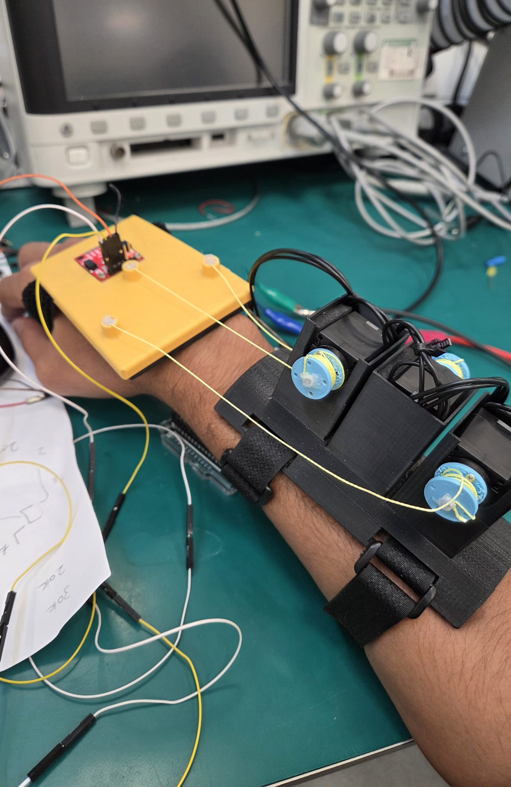

# Design and Development of a Unilateral Wrist Exoskeleton for Home-Based Stroke Rehabilitation

This repository contains the mechanical designs, kinematic models, and control architecture for a lightweight, unilateral, tendon-driven wrist exoskeleton. Designed specifically for unmonitored home-based stroke rehabilitation, the system targets the clinical condition of "wrist drop" by actively assisting fine motor movements without relying on heavy, rigid physical hinges.

*The assembled 3D-printed prototype*

---

## System Architecture

The device eliminates the bulky mechanisms found in traditional clinical robots by utilizing a remote tendon-driven parallel actuation strategy. The heavy electromechanical hardware is shifted proximally to the forearm, reducing the distal weight the patient must manipulate.

- **Mechanical Design:** A 3D-printed modular forearm anchor cuff and a "floating" dorsal hand plate, modeled in SolidWorks.
- **Actuation:** A 3-tendon parallel mechanism utilizing high-strength fishing line, driven by three Dynamixel XC330-M288-T smart servomotors.
- **Degrees of Freedom:** 2-DOF control covering flexion/extension and radial/ulnar deviation.
- **Embedded Electronics:** A dual-microcontroller architecture utilizing an Arduino MKR Zero for high-speed sensor data acquisition and an Arduino Mega R3 for deterministic motor control.
- **Spatial Tracking:** A FANSPARK BMI-270 Inertial Measurement Unit (IMU) mounted on the end-effector provides absolute spatial orientation tracking.

---

## Kinematic Modeling & Control

To ensure absolute safety for independent home use, the exoskeleton avoids volatile real-time sensor feedback loops (such as sEMG) and instead relies on mathematically deterministic trajectory control.

- **MATLAB Validation:** Robust inverse and forward kinematic formulations were derived and heavily validated via MATLAB.
- **Trajectory Planning:** The mathematical models successfully map target therapeutic clinical wrist angles ($\pm 30^\circ$) directly to precise linear motor spooling distances ($\Delta L$).
- **Continuous Passive Motion (CPM):** The system executes smooth, pre-calculated rehabilitative trajectories, ensuring the patient's wrist is guided safely without mechanical singularities.

*MATLAB simulation of the 3D reachable workspace and inverse kinematics validation*

---

## Future Work

The current prototype successfully proves the mathematical viability of the 3-tendon mechanism for CPM. Future development phases will focus on re-integrating a dense sensor network specifically Interlink FSR 400 force sensors and a multiplexed dual-IMU configuration to transition the control software from passive motion to a dynamic "Assist-as-Needed" admittance control loop.
